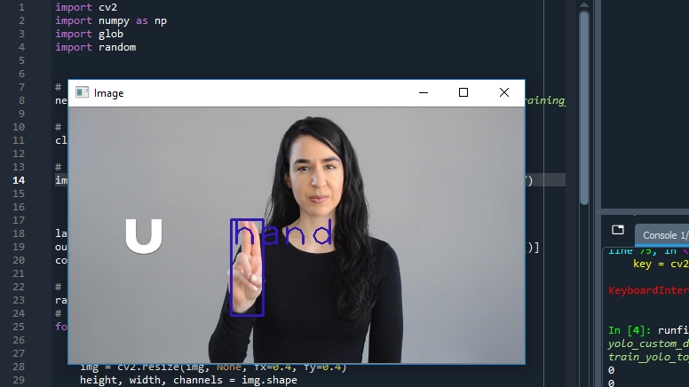

# How Train Yolov3

1. Download LabelImg in https://tzutalin.github.io/labelImg/
2. Labeling Image (you can see in my Medium https://bimap98.medium.com/how-to-train-yolo-v3-45120ead54bb)
3. Setting this bellow picture

4. But that's not absolute, you can see documentation in here (https://github.com/AlexeyAB/darknet#how-to-train-to-detect-your-custom-objects)
 
5. Train
 
6. Anyway the results will be like this, weights results each 1000 iteration

8. Let's test in yolo_object_detection.py and also dont forget set where thats weights and config from "net = cv2.dnn.readNet("yolov3_training_last.weights", "yolov3_testing.cfg")
 
7. This result our model

8. For config you can find here https://github.com/AlexeyAB/darknet/blob/master/cfg/yolov3.cfg or you can download in my repository
9. If you have any issue you can up Issues in my github repository
