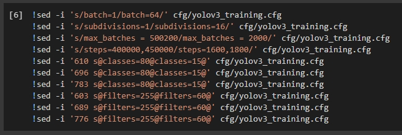

# How Train Yolov3

1. Download LabelImg in https://tzutalin.github.io/labelImg/
2. Labeling Image (you can see in my Medium https://bimap98.medium.com/how-to-train-yolo-v3-45120ead54bb)
3. Setting this bellow picture

4. But that's not absolute, you can see documentation in here https://github.com/AlexeyAB/darknet#how-to-train-to-detect-your-custom-objects
6. Train
7. Let's test in yolo_object_detection.py (dont forget set 

